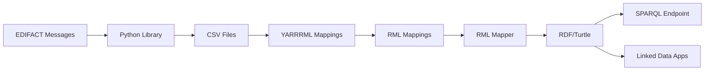

# YARRRML Mappings for MERITS EDIFACT Data

This folder contains YARRRML mappings to transform MERITS EDIFACT railway data (from CSV format) into RDF (Resource Description Framework) format, enabling semantic interoperability and linked data applications.

## Overview

YARRRML (YAML-based RDF Rule Mapping Language) is a human-friendly notation for defining mappings from CSV/JSON data to RDF. These mappings transform:

- **SKDUPD** (Schedule Update) - Railway timetable data
- **TSDUPD** (Timetable Static Data Update) - Railway location/station data

into RDF using a custom MERITS ontology aligned with Schema.org vocabularies.

## Directory Structure

```
yarrrml-mappings/
├── README.md                           # This file
├── merits-ontology.ttl                 # MERITS Railway Data Ontology
├── skdupd/
│   └── skdupd-mapping.yarrrml.yml     # YARRRML mapping for timetable data
├── tsdupd/
│   └── tsdupd-mapping.yarrrml.yml     # YARRRML mapping for location data
└── examples/
    ├── SKDUPD_all_fields_*.csv         # Sample SKDUPD CSV files
    └── TSDUPD_V3_*.csv                 # Sample TSDUPD CSV files
```

## Data Model

### SKDUPD (Schedule Update) Tables

1. **META** - Message metadata (validity period, originator)
2. **TRAIN** - Train service information (service number, name, operating days)
3. **POR** (Points of Route) - Stops with arrival/departure times
4. **RELATION** - Connections between trains at specific stations
5. **ODI** (Origin-Destination Information) - Service details between stop pairs

### TSDUPD (Timetable Static Data Update) Tables

1. **META** - Message metadata
2. **STOP** - Station/stop information (UIC codes, coordinates, timezone)
3. **SYNONYM** - Alternative names for stations
4. **MCT** (Minimum Connection Time) - Transfer time requirements
5. **FOOTPATH** - Walking connections between nearby stations

## Ontology

The `merits-ontology.ttl` file defines:

- **Classes**: Train, PointOfRoute, Stop, TrainConnection, Footpath, etc.
- **Properties**: Temporal (arrivalTime, departureTime), spatial (uicCode, coordinates), service-related properties
- **Alignments**: With Schema.org (TrainStation, TrainTrip, WalkAction, etc.) and Dublin Core

### Key Namespaces

```yaml
prefixes:
  merits: http://example.org/merits/ontology#       # MERITS-specific terms
  schema: http://schema.org/                         # Schema.org vocabulary
  dct: http://purl.org/dc/terms/                    # Dublin Core
  geo: http://www.w3.org/2003/01/geo/wgs84_pos#    # WGS84 coordinates
```

## Usage

### Prerequisites

1. **RML Mapper** - Install an RML/YARRRML processor:
   ```bash
   npm install -g @rmlio/yarrrml-parser
   npm install -g rmlmapper-java
   ```

2. **CSV Data** - Prepare your MERITS CSV files (exported from EDIFACT using this library)

### Step 1: Convert YARRRML to RML

YARRRML needs to be converted to RML (R2RML-based Mapping Language) first:

```bash
# For SKDUPD
yarrrml-parser -i yarrrml-mappings/skdupd/skdupd-mapping.yarrrml.yml \
               -o skdupd-mapping.rml.ttl

# For TSDUPD
yarrrml-parser -i yarrrml-mappings/tsdupd/tsdupd-mapping.yarrrml.yml \
               -o tsdupd-mapping.rml.ttl
```

### Step 2: Execute RML Mapping

Use RMLMapper to generate RDF from CSV files:

```bash
# For SKDUPD
java -jar rmlmapper.jar -m skdupd-mapping.rml.ttl \
     -o output-skdupd.ttl \
     -s turtle

# For TSDUPD
java -jar rmlmapper.jar -m tsdupd-mapping.rml.ttl \
     -o output-tsdupd.ttl \
     -s turtle
```

### Step 3: Query with SPARQL

Example SPARQL query to find all trains and their stops:

```sparql
PREFIX merits: <http://example.org/merits/ontology#>
PREFIX schema: <http://schema.org/>

SELECT ?trainName ?stopUIC ?arrivalTime ?departureTime
WHERE {
  ?train a merits:Train ;
         merits:serviceName ?trainName .

  ?por merits:belongsToTrain ?train ;
       merits:uicCode ?stopUIC ;
       merits:arrivalTime ?arrivalTime ;
       merits:departureTime ?departureTime .
}
ORDER BY ?trainName ?arrivalTime
```

## Integration Workflow



### Complete Workflow

1. **Convert EDIFACT to CSV**:
   ```bash
   # Using MERITS library
   merits-edifact-to-csv --input SKDUPD.r --output-dir ./csv-output
   ```

2. **Generate RDF**:
   ```bash
   # Convert YARRRML to RML
   yarrrml-parser -i yarrrml-mappings/skdupd/skdupd-mapping.yarrrml.yml \
                  -o skdupd.rml.ttl

   # Run RML Mapper
   java -jar rmlmapper.jar -m skdupd.rml.ttl -o skdupd.ttl
   ```

3. **Load into Triple Store**:
   ```bash
   # Example with Apache Jena Fuseki
   s-put http://localhost:3030/merits/data default skdupd.ttl
   ```

## Example Use Cases

### 1. Journey Planning
Query all trains from Station A to Station B with connection times:

```sparql
PREFIX merits: <http://example.org/merits/ontology#>

SELECT ?train ?departure ?arrival ?connectionTime
WHERE {
  ?por1 merits:uicCode "006070001" ;
        merits:departureTime ?departure ;
        merits:belongsToTrain ?train .

  ?por2 merits:belongsToTrain ?train ;
        merits:uicCode "006070013" ;
        merits:arrivalTime ?arrival .

  OPTIONAL {
    ?connection merits:atPointOfRoute ?por2 ;
                merits:transferTime ?connectionTime .
  }
}
```

### 2. Station Network Analysis
Find all stations with their walking connections:

```sparql
PREFIX merits: <http://example.org/merits/ontology#>
PREFIX geo: <http://www.w3.org/2003/01/geo/wgs84_pos#>

SELECT ?stopName ?lat ?long ?connectedStop ?walkTime
WHERE {
  ?stop a merits:Stop ;
        schema:name ?stopName ;
        geo:lat ?lat ;
        geo:long ?long .

  OPTIONAL {
    ?footpath merits:fromStop ?stop ;
              merits:toStopUicCode ?connectedStop ;
              merits:walkingTime ?walkTime .
  }
}
```

### 3. Service Provider Analysis
Aggregate trains by service provider:

```sparql
PREFIX merits: <http://example.org/merits/ontology#>

SELECT ?provider (COUNT(?train) as ?trainCount)
WHERE {
  ?train a merits:Train ;
         merits:serviceProvider ?provider .
}
GROUP BY ?provider
ORDER BY DESC(?trainCount)
```

## Data Quality and Validation

### SHACL Validation (Optional)

Create SHACL shapes to validate RDF data:

```turtle
@prefix sh: <http://www.w3.org/ns/shacl#> .
@prefix merits: <http://example.org/merits/ontology#> .

merits:TrainShape a sh:NodeShape ;
    sh:targetClass merits:Train ;
    sh:property [
        sh:path merits:serviceNumber ;
        sh:minCount 1 ;
        sh:datatype xsd:string ;
    ] ;
    sh:property [
        sh:path merits:serviceName ;
        sh:minCount 1 ;
    ] .
```

## Extending the Mappings

### Adding New Properties

1. **Update the Ontology** (`merits-ontology.ttl`):
   ```turtle
   merits:newProperty a owl:DatatypeProperty ;
       rdfs:label "new property" ;
       rdfs:domain merits:Train ;
       rdfs:range xsd:string .
   ```

2. **Update YARRRML Mapping**:
   ```yaml
   train:
     sources:
       - ['SKDUPD_TRAIN.csv~csv']
     s: skdupd:train/$(train_id)
     po:
       - [merits:newProperty, $(new_field)]
   ```

### Linking to External Datasets

Link stations to Wikidata or other LOD sources:

```yaml
stop:
  sources:
    - ['TSDUPD_STOP.csv~csv']
  s: tsdupd:stop/$(stop_id)
  po:
    - [owl:sameAs, http://www.wikidata.org/entity/$(wikidata_id)~iri]
```

## Performance Considerations

- **Large Datasets**: For EDIFACT files with thousands of trains, consider:
  - Splitting CSV files into chunks
  - Using streaming RML processors
  - Indexing the triple store appropriately

- **Optimization**:
  - Use appropriate RDF serialization (Turtle for readability, N-Triples for performance)
  - Create indices on frequently queried properties (uicCode, serviceNumber)

## Tools and Resources

### RML/YARRRML Tools
- [YARRRML Parser](https://github.com/RMLio/yarrrml-parser) - Convert YARRRML to RML
- [RMLMapper](https://github.com/RMLio/rmlmapper-java) - Execute RML mappings
- [Matey](https://rml.io/yarrrml/matey/) - Web-based YARRRML editor

### Triple Stores
- [Apache Jena Fuseki](https://jena.apache.org/documentation/fuseki2/) - Open-source SPARQL server
- [GraphDB](https://www.ontotext.com/products/graphdb/) - High-performance RDF database
- [Virtuoso](https://virtuoso.openlinksw.com/) - Universal server for RDF

### Validation
- [SHACL Playground](https://shacl.org/playground/) - Test SHACL shapes
- [pySHACL](https://github.com/RDFLib/pySHACL) - Python SHACL validator

## License

These mappings follow the same license as the MERITS Transformation Tools library.

## Contributing

To contribute improvements to these mappings:

1. Test your changes with sample data
2. Validate generated RDF with SHACL shapes
3. Document any new properties or classes
4. Submit a pull request with examples

## References

- [YARRRML Specification](https://rml.io/yarrrml/spec/)
- [RML Specification](https://rml.io/specs/rml/)
- [MERITS EDIFACT Documentation](../README.md)
- [Schema.org](https://schema.org/)
- [W3C RDF Primer](https://www.w3.org/TR/rdf11-primer/)

## Contact

For questions about these mappings or the MERITS transformation tools, please open an issue in the repository.
