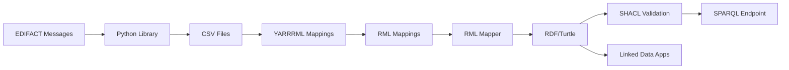

# YARRRML Mappings for MERITS EDIFACT Data

This folder contains YARRRML mappings to transform MERITS EDIFACT railway data (from CSV format) into RDF (Resource Description Framework) format, enabling semantic interoperability and linked data applications.

## Overview

YARRRML (YAML-based RDF Rule Mapping Language) is a human-friendly notation for defining mappings from CSV/JSON data to RDF. These mappings transform:

- **SKDUPD** (Schedule Update) - Railway timetable data
- **TSDUPD** (Timetable Static Data Update) - Railway location/station data

into RDF using a custom MERITS ontology aligned with Schema.org, W3C Time Ontology, and GTFS vocabularies.

## Directory Structure

```
yarrrml-mappings/
├── README.md                           # This file
├── merits-ontology.ttl                 # MERITS Railway Data Ontology (v1.1.0)
├── merits-shapes.ttl                   # SHACL shapes for RDF validation
├── queries/
│   └── operating-days-queries.rq       # SPARQL queries for operating days
├── skdupd/
│   └── skdupd-mapping.yarrrml.yml      # YARRRML mapping for timetable data
├── tsdupd/
│   └── tsdupd-mapping.yarrrml.yml      # YARRRML mapping for location data
├── output/
│   ├── skdupd-mapping.rml.ttl          # Generated RML mapping
│   ├── skdupd-output.ttl               # Generated RDF output
│   ├── tsdupd-mapping.rml.ttl          # Generated RML mapping
│   └── tsdupd-output.ttl               # Generated RDF output
└── examples/
    ├── example-output.ttl              # Example RDF output with SPARQL queries
    ├── SKDUPD_all_fields_*.csv         # Sample SKDUPD CSV files
    └── TSDUPD_V3_*.csv                 # Sample TSDUPD CSV files
```

## Data Model

### SKDUPD (Schedule Update) Tables

1. **META** - Message metadata (validity period, originator)
2. **TRAIN** - Train service information (service number, name, operating days)
3. **POR** (Points of Route) - Stops with arrival/departure times
4. **RELATION** - Connections between trains at specific stations
5. **ODI** (Origin-Destination Information) - Service details between stop pairs

### TSDUPD (Timetable Static Data Update) Tables

1. **META** - Message metadata
2. **STOP** - Station/stop information (UIC codes, coordinates, timezone)
3. **SYNONYM** - Alternative names for stations
4. **MCT** (Minimum Connection Time) - Transfer time requirements
5. **FOOTPATH** - Walking connections between nearby stations

## Ontology

The `merits-ontology.ttl` file (v1.1.0) defines:

### Classes

| Class | Parent | Description |
|-------|--------|-------------|
| `era:Train` | `schema:TrainTrip` | Train service with operating characteristics |
| `era:PointOfRoute` | `schema:TrainStation` | Stop on a train's route |
| `era:Stop` | `schema:TrainStation`, `schema:Place` | Railway station/location |
| `era:TrainConnection` | `schema:TrainConnection` | Connection between trains |
| `era:Footpath` | `schema:WalkAction` | Walking connection between stations |
| `era:MinimumConnectionTime` | `schema:TransferAction` | Transfer time requirements |
| `era:OperatingSchedule` | `time:TemporalEntity` | Semantic operating days (NEW) |

### Key Namespaces

```turtle
@prefix era: <http://data.europa.eu/949/> .           # ERA/MERITS terms
@prefix merits: <http://example.org/merits/ontology#> . # MERITS-specific terms
@prefix schema: <http://schema.org/> .                 # Schema.org vocabulary
@prefix time: <http://www.w3.org/2006/time#> .        # W3C Time Ontology
@prefix gtfs: <http://vocab.gtfs.org/terms#> .        # GTFS vocabulary
@prefix dct: <http://purl.org/dc/terms/> .            # Dublin Core
@prefix geo: <http://www.w3.org/2003/01/geo/wgs84_pos#> . # WGS84 coordinates
```

## Operating Days: Binary vs Semantic

### Binary Format (Legacy EDIFACT)

The `era:operatingDays` property uses a 7-character binary string:

| Position | 1 | 2 | 3 | 4 | 5 | 6 | 7 |
|----------|---|---|---|---|---|---|---|
| Day | Mon | Tue | Wed | Thu | Fri | Sat | Sun |

Examples:
- `"1010101"` = Monday, Wednesday, Friday, Sunday
- `"1111100"` = Weekdays (Monday-Friday)
- `"0000011"` = Weekend only

### Semantic Format (W3C Time Ontology)

The `era:operatesOnDay` property links to `time:DayOfWeek` individuals:

```turtle
skdupd:train/1 a era:Train ;
    era:serviceName "ALPHA TANGO"@en ;
    era:operatesOnDay time:Monday, time:Wednesday, time:Friday, time:Sunday .
```

**Benefits of semantic approach:**
- Machine-readable day references
- SPARQL queryable: `SELECT ?train WHERE { ?train era:operatesOnDay time:Monday }`
- Interoperable with GTFS, schema.org, NeTEx
- Supports reasoning and inference

## SHACL Validation

The `merits-shapes.ttl` file provides comprehensive validation shapes:

### Available Shapes

| Shape | Target Class | Key Validations |
|-------|--------------|-----------------|
| `MessageMetadataShape` | `merits:MessageMetadata` | Required identifier, date validations |
| `TrainShape` | `era:Train` | Service number, operating days pattern |
| `PointOfRouteShape` | `merits:PointOfRoute` | UIC code (9-digit), time validations |
| `StopShape` | `merits:Stop` | UIC code, country code (ISO 2-letter) |
| `OperatingScheduleShape` | `merits:OperatingSchedule` | Semantic days, exception dates |
| `GTFSCalendarShape` | `gtfs:Calendar` | GTFS-compatible calendar validation |

### Running Validation

```bash
# Using pySHACL
pyshacl -s merits-shapes.ttl -d output/skdupd-output.ttl

# Using Apache Jena
shacl validate --shapes merits-shapes.ttl --data output/skdupd-output.ttl

# Using TopBraid SHACL API
java -jar shacl-1.4.2.jar validate -s merits-shapes.ttl -d output.ttl
```

## SPARQL Queries

The `queries/operating-days-queries.rq` file contains useful queries:

| Query | Description |
|-------|-------------|
| Query 1 | Find all trains operating on Monday |
| Query 2 | List operating days as readable names |
| Query 3 | **Construct binary string from semantic days** |
| Query 4 | CONSTRUCT to generate legacy `operatingDays` |
| Query 5 | INSERT to convert binary → semantic |
| Query 6 | Compare both formats side by side |
| Query 7 | Find weekday-only trains |
| Query 8 | Find weekend trains |
| Query 9 | Count trains by operating days |
| Query 10 | Find trains with exception dates |

### Example: Reconstruct Binary from Semantic

```sparql
PREFIX era: <http://data.europa.eu/949/>
PREFIX time: <http://www.w3.org/2006/time#>

SELECT ?train ?serviceName
       (CONCAT(
           IF(BOUND(?mon), "1", "0"),
           IF(BOUND(?tue), "1", "0"),
           IF(BOUND(?wed), "1", "0"),
           IF(BOUND(?thu), "1", "0"),
           IF(BOUND(?fri), "1", "0"),
           IF(BOUND(?sat), "1", "0"),
           IF(BOUND(?sun), "1", "0")
       ) AS ?binaryString)
WHERE {
    ?train a era:Train ;
           era:serviceName ?serviceName .

    OPTIONAL { ?train era:operatesOnDay time:Monday . BIND(time:Monday AS ?mon) }
    OPTIONAL { ?train era:operatesOnDay time:Tuesday . BIND(time:Tuesday AS ?tue) }
    OPTIONAL { ?train era:operatesOnDay time:Wednesday . BIND(time:Wednesday AS ?wed) }
    OPTIONAL { ?train era:operatesOnDay time:Thursday . BIND(time:Thursday AS ?thu) }
    OPTIONAL { ?train era:operatesOnDay time:Friday . BIND(time:Friday AS ?fri) }
    OPTIONAL { ?train era:operatesOnDay time:Saturday . BIND(time:Saturday AS ?sat) }
    OPTIONAL { ?train era:operatesOnDay time:Sunday . BIND(time:Sunday AS ?sun) }
}
```

## Usage

### Prerequisites

1. **RML Mapper** - Install an RML/YARRRML processor:
   ```bash
   npm install -g @rmlio/yarrrml-parser
   npm install -g rmlmapper-java
   ```

2. **CSV Data** - Prepare your MERITS CSV files (exported from EDIFACT using this library)

### Step 1: Convert YARRRML to RML

```bash
# For SKDUPD
yarrrml-parser -i yarrrml-mappings/skdupd/skdupd-mapping.yarrrml.yml \
               -o output/skdupd-mapping.rml.ttl

# For TSDUPD
yarrrml-parser -i yarrrml-mappings/tsdupd/tsdupd-mapping.yarrrml.yml \
               -o output/tsdupd-mapping.rml.ttl
```

### Step 2: Execute RML Mapping

```bash
# For SKDUPD
java -jar rmlmapper.jar -m output/skdupd-mapping.rml.ttl \
     -o output/skdupd-output.ttl \
     -s turtle

# For TSDUPD
java -jar rmlmapper.jar -m output/tsdupd-mapping.rml.ttl \
     -o output/tsdupd-output.ttl \
     -s turtle
```

### Step 3: Validate with SHACL

```bash
pyshacl -s merits-shapes.ttl -d output/skdupd-output.ttl -f human
```

### Step 4: Query with SPARQL

```bash
# Using Apache Jena ARQ
arq --data output/skdupd-output.ttl --query queries/operating-days-queries.rq
```

## Integration Workflow



### Complete Workflow

1. **Convert EDIFACT to CSV**:
   ```bash
   merits-convert --input SKDUPD.r --output-dir ./csv-output
   ```

2. **Generate RDF**:
   ```bash
   yarrrml-parser -i yarrrml-mappings/skdupd/skdupd-mapping.yarrrml.yml \
                  -o skdupd.rml.ttl
   java -jar rmlmapper.jar -m skdupd.rml.ttl -o skdupd.ttl
   ```

3. **Validate**:
   ```bash
   pyshacl -s yarrrml-mappings/merits-shapes.ttl -d skdupd.ttl
   ```

4. **Load into Triple Store**:
   ```bash
   # Apache Jena Fuseki
   s-put http://localhost:3030/merits/data default skdupd.ttl
   ```

## Example Use Cases

### 1. Journey Planning
Query all trains from Station A to Station B:

```sparql
PREFIX era: <http://data.europa.eu/949/>

SELECT ?train ?departure ?arrival
WHERE {
  ?por1 era:uicCode "006070001" ;
        era:departureTime ?departure ;
        era:belongsToTrain ?train .

  ?por2 era:belongsToTrain ?train ;
        era:uicCode "006070013" ;
        era:arrivalTime ?arrival .
}
```

### 2. Find Trains Operating on Specific Days

```sparql
PREFIX era: <http://data.europa.eu/949/>
PREFIX time: <http://www.w3.org/2006/time#>

SELECT ?train ?serviceName
WHERE {
  ?train a era:Train ;
         era:serviceName ?serviceName ;
         era:operatesOnDay time:Monday ;
         era:operatesOnDay time:Friday .
}
```

### 3. Station Network with Walking Connections

```sparql
PREFIX era: <http://data.europa.eu/949/>
PREFIX schema: <http://schema.org/>
PREFIX geo: <http://www.w3.org/2003/01/geo/wgs84_pos#>

SELECT ?stopName ?lat ?long ?connectedStop ?walkTime
WHERE {
  ?stop a era:Stop ;
        era:opName ?stopName ;
        geo:lat ?lat ;
        geo:long ?long .

  OPTIONAL {
    ?footpath era:fromStop ?stop ;
              era:uicCode2 ?connectedStop ;
              era:duration ?walkTime .
  }
}
```

## Extending the Mappings

### Adding Semantic Operating Days

To convert existing binary operating days to semantic format:

1. **In your RDF transformation**, add:
   ```turtle
   skdupd:train/1
       era:operatesOnDay time:Monday, time:Wednesday, time:Friday .
   ```

2. **Or use SPARQL UPDATE** (see `queries/operating-days-queries.rq`, Query 5)

### Linking to External Datasets

Link stations to Wikidata or other LOD sources:

```yaml
stop:
  sources:
    - ['TSDUPD_STOP.csv~csv']
  s: tsdupd:stop/$(stop_id)
  po:
    - [owl:sameAs, http://www.wikidata.org/entity/$(wikidata_id)~iri]
```

## Tools and Resources

### RML/YARRRML Tools
- [YARRRML Parser](https://github.com/RMLio/yarrrml-parser) - Convert YARRRML to RML
- [RMLMapper](https://github.com/RMLio/rmlmapper-java) - Execute RML mappings
- [Matey](https://rml.io/yarrrml/matey/) - Web-based YARRRML editor

### Triple Stores
- [Apache Jena Fuseki](https://jena.apache.org/documentation/fuseki2/) - Open-source SPARQL server
- [GraphDB](https://www.ontotext.com/products/graphdb/) - High-performance RDF database
- [Virtuoso](https://virtuoso.openlinksw.com/) - Universal server for RDF

### Validation Tools
- [pySHACL](https://github.com/RDFLib/pySHACL) - Python SHACL validator
- [SHACL Playground](https://shacl.org/playground/) - Online SHACL testing
- [Apache Jena SHACL](https://jena.apache.org/documentation/shacl/) - Jena SHACL support

### Ontology References
- [W3C Time Ontology](https://www.w3.org/TR/owl-time/) - Temporal concepts
- [GTFS Vocabulary](http://vocab.gtfs.org/terms) - Transit data vocabulary
- [Schema.org](https://schema.org/) - General-purpose vocabulary

## License

These mappings follow the same license as the MERITS Transformation Tools library (Apache 2.0).

## Contributing

To contribute improvements to these mappings:

1. Test your changes with sample data
2. Validate generated RDF with SHACL shapes (`merits-shapes.ttl`)
3. Document any new properties or classes in the ontology
4. Add SPARQL queries for new functionality
5. Submit a pull request with examples

## References

- [YARRRML Specification](https://rml.io/yarrrml/spec/)
- [RML Specification](https://rml.io/specs/rml/)
- [W3C Time Ontology](https://www.w3.org/TR/owl-time/)
- [SHACL Specification](https://www.w3.org/TR/shacl/)
- [MERITS EDIFACT Documentation](../README-MERITS.md)
- [Schema.org](https://schema.org/)
- [W3C RDF Primer](https://www.w3.org/TR/rdf11-primer/)

## Contact

For questions about these mappings or the MERITS transformation tools, please open an issue in the repository.
